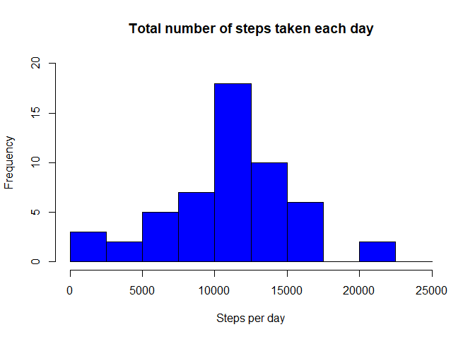
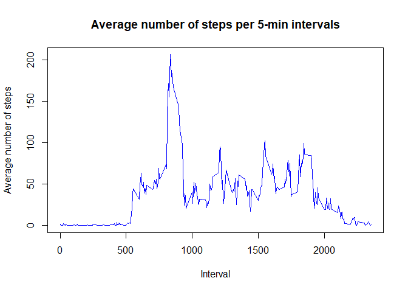
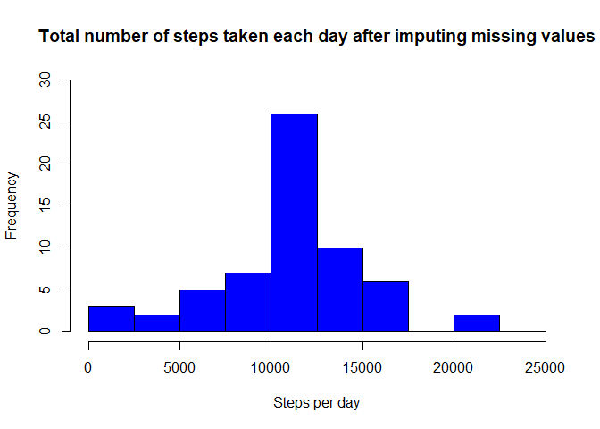
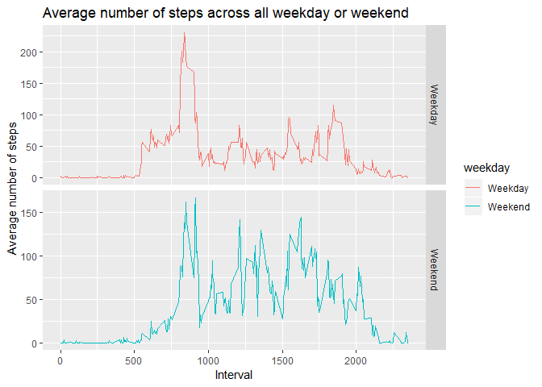

1. read and process data
========================

1.1. Unzip and read the data
----------------------------

    unzip("repdata%2Fdata%2Factivity.zip")
    activity <- read.csv("activity.csv")
    str(activity)

    ## 'data.frame':    17568 obs. of  3 variables:
    ##  $ steps   : int  NA NA NA NA NA NA NA NA NA NA ...
    ##  $ date    : Factor w/ 61 levels "2012-10-01","2012-10-02",..: 1 1 1 1 1 1 1 1 1 1 ...
    ##  $ interval: int  0 5 10 15 20 25 30 35 40 45 ...

1.2. Transform the time data into data format
---------------------------------------------

    library(lubridate)

    ## 
    ## Attaching package: 'lubridate'

    ## The following object is masked from 'package:base':
    ## 
    ##     date

    activity$date<-ymd(activity$date)

2. Histrogram of the total number of steps taken each day
=========================================================

2.1. Calculate the total number of steps taken per day
------------------------------------------------------

    library(dplyr)

    ## 
    ## Attaching package: 'dplyr'

    ## The following objects are masked from 'package:lubridate':
    ## 
    ##     intersect, setdiff, union

    ## The following objects are masked from 'package:stats':
    ## 
    ##     filter, lag

    ## The following objects are masked from 'package:base':
    ## 
    ##     intersect, setdiff, setequal, union

    activity_date <- aggregate(steps ~ date, activity, sum)
    summary(activity_date)

    ##       date                steps      
    ##  Min.   :2012-10-02   Min.   :   41  
    ##  1st Qu.:2012-10-16   1st Qu.: 8841  
    ##  Median :2012-10-29   Median :10765  
    ##  Mean   :2012-10-30   Mean   :10766  
    ##  3rd Qu.:2012-11-16   3rd Qu.:13294  
    ##  Max.   :2012-11-29   Max.   :21194

2.2. Histrogram of the total number of steps taken each day
-----------------------------------------------------------

    hist(activity_date$steps, main = "Total number of steps taken each day", xlab = "Steps per day", col = "blue", breaks = seq(0,25000, by = 2500), ylim = c(0,20))

3. Mean and median number of steps taken each day
=================================================

    activity_mean <- aggregate(steps ~ date, activity, mean, na.rm = T)
    activity_mean

    ##          date      steps
    ## 1  2012-10-02  0.4375000
    ## 2  2012-10-03 39.4166667
    ## 3  2012-10-04 42.0694444
    ## 4  2012-10-05 46.1597222
    ## 5  2012-10-06 53.5416667
    ## 6  2012-10-07 38.2465278
    ## 7  2012-10-09 44.4826389
    ## 8  2012-10-10 34.3750000
    ## 9  2012-10-11 35.7777778
    ## 10 2012-10-12 60.3541667
    ## 11 2012-10-13 43.1458333
    ## 12 2012-10-14 52.4236111
    ## 13 2012-10-15 35.2048611
    ## 14 2012-10-16 52.3750000
    ## 15 2012-10-17 46.7083333
    ## 16 2012-10-18 34.9166667
    ## 17 2012-10-19 41.0729167
    ## 18 2012-10-20 36.0937500
    ## 19 2012-10-21 30.6284722
    ## 20 2012-10-22 46.7361111
    ## 21 2012-10-23 30.9652778
    ## 22 2012-10-24 29.0104167
    ## 23 2012-10-25  8.6527778
    ## 24 2012-10-26 23.5347222
    ## 25 2012-10-27 35.1354167
    ## 26 2012-10-28 39.7847222
    ## 27 2012-10-29 17.4236111
    ## 28 2012-10-30 34.0937500
    ## 29 2012-10-31 53.5208333
    ## 30 2012-11-02 36.8055556
    ## 31 2012-11-03 36.7048611
    ## 32 2012-11-05 36.2465278
    ## 33 2012-11-06 28.9375000
    ## 34 2012-11-07 44.7326389
    ## 35 2012-11-08 11.1770833
    ## 36 2012-11-11 43.7777778
    ## 37 2012-11-12 37.3784722
    ## 38 2012-11-13 25.4722222
    ## 39 2012-11-15  0.1423611
    ## 40 2012-11-16 18.8923611
    ## 41 2012-11-17 49.7881944
    ## 42 2012-11-18 52.4652778
    ## 43 2012-11-19 30.6979167
    ## 44 2012-11-20 15.5277778
    ## 45 2012-11-21 44.3993056
    ## 46 2012-11-22 70.9270833
    ## 47 2012-11-23 73.5902778
    ## 48 2012-11-24 50.2708333
    ## 49 2012-11-25 41.0902778
    ## 50 2012-11-26 38.7569444
    ## 51 2012-11-27 47.3819444
    ## 52 2012-11-28 35.3576389
    ## 53 2012-11-29 24.4687500

    activity_median <- aggregate(steps ~ date, activity, median, na.rm = T)
    activity_median

    ##          date steps
    ## 1  2012-10-02     0
    ## 2  2012-10-03     0
    ## 3  2012-10-04     0
    ## 4  2012-10-05     0
    ## 5  2012-10-06     0
    ## 6  2012-10-07     0
    ## 7  2012-10-09     0
    ## 8  2012-10-10     0
    ## 9  2012-10-11     0
    ## 10 2012-10-12     0
    ## 11 2012-10-13     0
    ## 12 2012-10-14     0
    ## 13 2012-10-15     0
    ## 14 2012-10-16     0
    ## 15 2012-10-17     0
    ## 16 2012-10-18     0
    ## 17 2012-10-19     0
    ## 18 2012-10-20     0
    ## 19 2012-10-21     0
    ## 20 2012-10-22     0
    ## 21 2012-10-23     0
    ## 22 2012-10-24     0
    ## 23 2012-10-25     0
    ## 24 2012-10-26     0
    ## 25 2012-10-27     0
    ## 26 2012-10-28     0
    ## 27 2012-10-29     0
    ## 28 2012-10-30     0
    ## 29 2012-10-31     0
    ## 30 2012-11-02     0
    ## 31 2012-11-03     0
    ## 32 2012-11-05     0
    ## 33 2012-11-06     0
    ## 34 2012-11-07     0
    ## 35 2012-11-08     0
    ## 36 2012-11-11     0
    ## 37 2012-11-12     0
    ## 38 2012-11-13     0
    ## 39 2012-11-15     0
    ## 40 2012-11-16     0
    ## 41 2012-11-17     0
    ## 42 2012-11-18     0
    ## 43 2012-11-19     0
    ## 44 2012-11-20     0
    ## 45 2012-11-21     0
    ## 46 2012-11-22     0
    ## 47 2012-11-23     0
    ## 48 2012-11-24     0
    ## 49 2012-11-25     0
    ## 50 2012-11-26     0
    ## 51 2012-11-27     0
    ## 52 2012-11-28     0
    ## 53 2012-11-29     0

4. Time series plot of the average number of steps taken
========================================================

4.1. Make a time series plot (type = "l") of the 5-minute interval (x-axis) and the average number of steps taken, averaged across all days (y-axis)
----------------------------------------------------------------------------------------------------------------------------------------------------

    activity_interval <- aggregate(steps ~ interval, activity, mean, na.rm = TRUE)
    with(activity_interval, plot(interval, steps, type = "l", col = "blue", xlab = "Interval", ylab = "Average number of steps", main = "Average number of steps per 5-min intervals"))

5 Which 5-minute interval, on average across all the days in the dataset, contains the maximum number of steps?
===============================================================================================================

    activity_interval[which.max(activity_interval$steps),]$interval

    ## [1] 835

6. Code to describe and show a strategy for imputing missing data
=================================================================

6.1. Calculate the total number of missing values in the dataset
----------------------------------------------------------------

    sum(is.na(activity$steps))

    ## [1] 2304

6.2. Devise a strategy for filling in all of the missing values in the dataset. (I filled the missing values with the average number of step per intervals)
-----------------------------------------------------------------------------------------------------------------------------------------------------------

    imputing <- activity_interval$steps[match(activity$interval, activity_interval$interval)]
    str(imputing)

    ##  num [1:17568] 1.717 0.3396 0.1321 0.1509 0.0755 ...

6.3. Create a new dataset that is equal to the original dataset but with the missing data filled in.
----------------------------------------------------------------------------------------------------

    activity_imputed <- transform(activity, steps = ifelse(is.na(activity$steps), yes = imputing, no = activity$steps))

6.4.1. Make a histogram of the total number of steps taken each day
-------------------------------------------------------------------

    activity_imputed_date <- aggregate(steps ~ date, activity_imputed, sum)
    hist(activity_imputed_date$steps, main = "Total number of steps taken each day after imputing missing values", xlab = "Steps per day", col = "blue", breaks = seq(0,25000, by = 2500), ylim = c(0,30))

\#\#6.4.2 Calculate and report the mean and median total number of steps
taken per day.

    mean(activity_imputed_date$steps)

    ## [1] 10766.19

    median(activity_imputed_date$steps)

    ## [1] 10766.19

7. Panel plot comparing the average number of steps taken per 5-minute interval across weekdays and weekends
============================================================================================================

7.1. Create a new factor variable in the dataset with two levels ??? “weekday” and “weekend” indicating whether a given date is a weekday or weekend day.
---------------------------------------------------------------------------------------------------------------------------------------------------------

    Sys.setlocale(category = "LC_TIME", "English")

    ## [1] "English_United States.1252"

    table(weekdays(activity_imputed$date))

    ## 
    ##    Friday    Monday  Saturday    Sunday  Thursday   Tuesday Wednesday 
    ##      2592      2592      2304      2304      2592      2592      2592

    activity_imputed$weekday <- sapply(activity$date, function(x) {
            if (weekdays(x) == "Saturday" | weekdays(x) == "Sunday") 
                    {y <- "Weekend"} else 
                    {y <- "Weekday"}
                    y
            })
    table(activity_imputed$weekday)

    ## 
    ## Weekday Weekend 
    ##   12960    4608

7.2. Make a panel plot containing a time series plot of the 5-minute interval (x-axis) and the average number of steps taken, averaged across all weekday days or weekend days (y-axis).
----------------------------------------------------------------------------------------------------------------------------------------------------------------------------------------

    activity_imputed_weekdays <- aggregate(steps ~ interval + weekday, activity_imputed, mean)
    library(ggplot2)
    ggplot(activity_imputed_weekdays, aes(x = interval , y = steps, color = weekday)) +
            geom_line() +
            labs(title = "Average number of steps across all weekday or weekend", x = "Interval", y = "Average number of steps") +
            facet_grid(weekday~., scale = "free")

